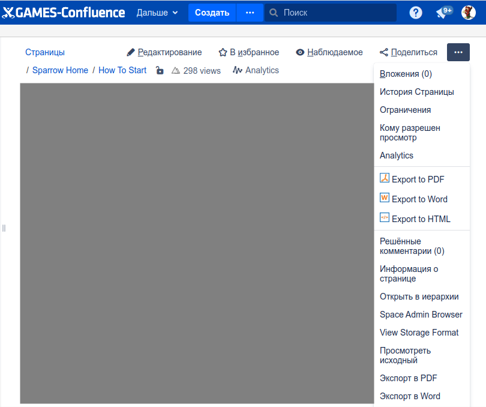
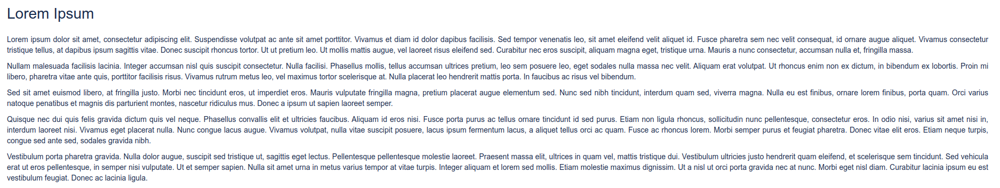
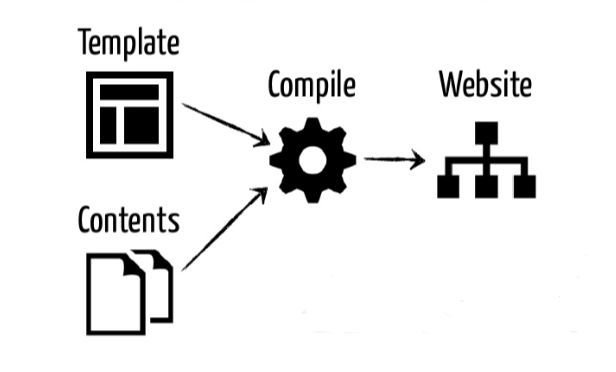
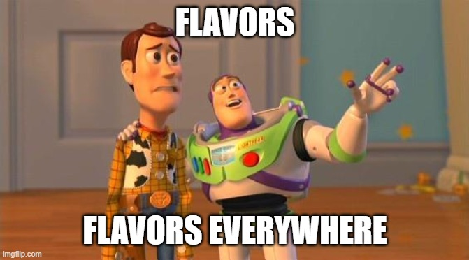

= Docs as a code
Марат Радченко <https://github.com/slonopotamus[@slonopotamus]>
v1.0, 2023-03-28
:source-highlighter: highlightjs
:revealjs_hash: true
:revealjs_theme: blood
:revealjsdir: https://cdn.jsdelivr.net/npm/reveal.js@3.9.2
:icons: font

**{revdate}**

== Confluence - MSOffice в вебе

=== Перегруженный UI

=== Скоуп - одна страница

=== Версионирование само по себе

=== Отвратительные урлы

https://games-confluence.mail.ru/pages/viewpage.action?pageId=183527494[]

image::images/nausea.png[]

=== Очень, очень плохой поиск

=== Низкая читабельность текста

=== Разные юзкейсы

- Документация
- Сбор фидбека

=== Не нравится никому

(вероятно, кроме менеджмента)

=== А можно лучше?

== Static Site Generators

=== !

- Hugo
- Gatsby
- Antora
- Jekyll
- ...

=== Языки разметки

- Markdown
- reStructuredText
- AsciiDoc

=== Дзен текстовой разметки

Отказ от хитрого форматирования

Фокус на контенте

=== !

[source,markdown]
----
include::partials/example.md[]
----

=== Исходники в репозитории

- Версионирование
- Линтеры/чекеры
- Ревью
- Mass update
- Генерация побочных артефактов (схемы, графики, API-документация)

[.columns]
=== !

.page.adoc
[source,asciidoc,.column]
-----
[plantuml]
----
\include::scheme.puml[]
----
-----

.scheme.puml
[source,puml,.column]
----
include::partials/scheme.puml[]
----

[.column]
[plantuml]
----
include::partials/scheme.puml[]
----

== GitLab Pages

..gitlab-ci.yml
[source,yaml]
----
pages:
  script:
    - generate some HTML
    - put files to <repo>/public
  artifacts:
    paths:
      - public
----

icon:magic[]

https://mygroup.gitlab.io/myproject/

== Что не так с Markdown

=== !

Инлюдов тоже нет

=== !

[.columns]
=== Markdown Flavors

[.column]
- Bitbucket's Markdown
- CommonMark
- CriticMarkup
- Discount
- DocFX
- ExtraMark
- Ghost

[.column]
- GitHub Flavored
- GitLab Flavored
- Haroopad Flavored
- iA Writer's
- Kramdown

[.column]
- Leanpub Flavore
- Litedown
- Lunamark
- Madoko
- Markdown
- Markdown 2
- ...

=== В непонятной ситуации

[source,markdown]
----

This is a note.

----

Прибито гвоздями к конкретному парсеру

Нет поддержки в редакторе

== Так вообще кто-то делает?

Да, все :)

.Примеры
- https://docs.fedoraproject.org/en-US/fedora/latest/[docs.fedoraproject.org]
- https://learn.microsoft.com/en-us/windows/apps/get-started/[learn.microsoft.com]
- https://docs.gitlab.com/ee/user/[docs.gitlab.com]
- https://jenkins.io/doc/[jenkins.io/doc]
- И т.д.

=== Возможные проблемы

- Adoption ГД
- Adoption менеджментом

=== Showcase

- https://sprw.pages.at.dev-my.games/sprw/sprw/[SPRW]
- https://d1.pages.at.dev-my.games/docs/[D1]

== Q & A
